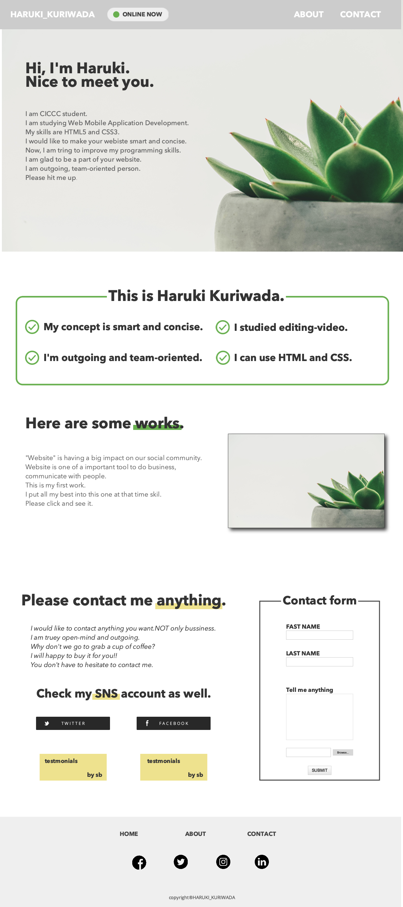

## 1, Create mockup.

This is mockup image.

## 2, start coding with HTML, CSS and a bit of JavaScript.

## 3, This is the final Website model (not working Message functionality...) 
<a href="">Go and See my first portfolio model</a>
